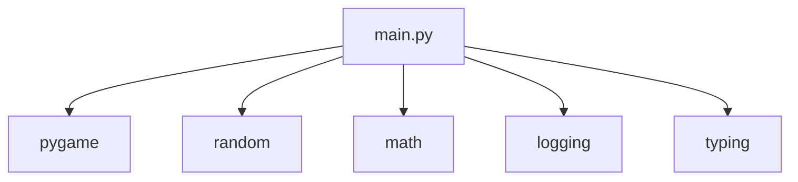
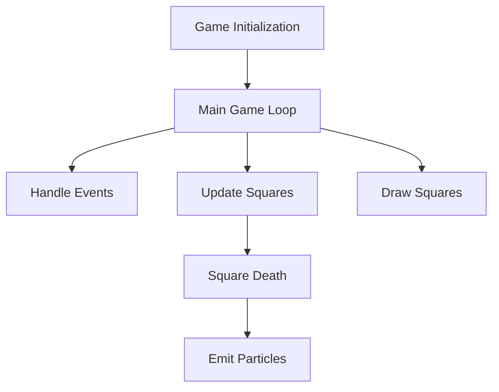
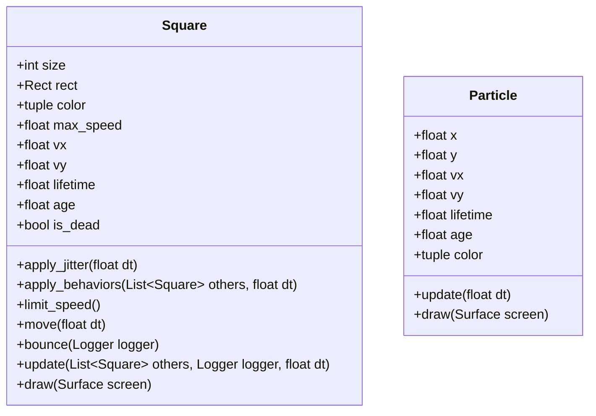
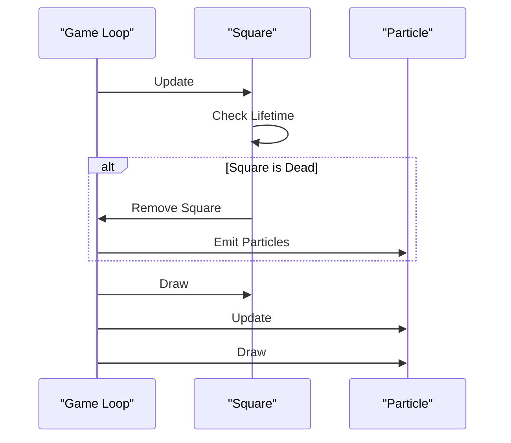

# Project Architecture

## Module Dependency Graph

```mermaid
graph TD
    A["main.py"] --> B["pygame"]
    A --> C["random"]
    A --> D["math"]
    A --> E["logging"]
    A --> F["typing"]
```

## High-Level System Flow

```mermaid
graph TD
    A["Game Initialization"] --> B["Main Game Loop"]
    B --> C["Handle Events"]
    B --> D["Update Squares"]
    B --> E["Draw Squares"]
    D --> F["Square Death"]
    F --> G["Emit Particles"]
```

## Class Diagram

```mermaid
classDiagram
    class Square {
        +int size
        +Rect rect
        +tuple color
        +float max_speed
        +float vx
        +float vy
        +float lifetime
        +float age
        +bool is_dead
        +apply_jitter(float dt)
        +apply_behaviors(List~Square~ others, float dt)
        +limit_speed()
        +move(float dt)
        +bounce(Logger logger)
        +update(List~Square~ others, Logger logger, float dt)
        +draw(Surface screen)
    }

    class Particle {
        +float x
        +float y
        +float vx
        +float vy
        +float lifetime
        +float age
        +tuple color
        +update(float dt)
        +draw(Surface screen)
    }
```

## Sequence Diagram

```mermaid
sequenceDiagram
    participant G as "Game Loop"
    participant S as "Square"
    participant P as "Particle"

    G->>S: Update
    S->>S: Check Lifetime
    alt Square is Dead
        S->>G: Remove Square
        G->>P: Emit Particles
    end
    G->>S: Draw
    G->>P: Update
    G->>P: Draw
```
